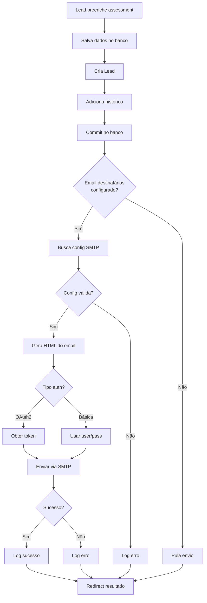

# Sistema de Notificações por E-mail

## 📋 Visão Geral

Sistema completo de envio de e-mails SMTP com notificações automáticas quando novos leads são capturados via assessment público.

## 🚀 Funcionalidades Implementadas

### 1. **Configurações SMTP Centralizadas** (`/admin/parametros/smtp`)
- ✅ Suporte para autenticação **básica** (usuário/senha)
- ✅ Suporte para **OAuth2 Microsoft 365** (recomendado)
- ✅ Configuração de servidor, porta, TLS/SSL
- ✅ Dados sensíveis criptografados no banco de dados
- ✅ Interface amigável com alternância dinâmica entre tipos de autenticação

### 2. **Notificações de Novos Leads**
- ✅ E-mail automático quando lead preenche assessment público
- ✅ Configuração de destinatários por tipo de assessment
- ✅ Template HTML responsivo e profissional
- ✅ Informações do lead (nome, e-mail, telefone, empresa)
- ✅ Pontuação geral e por domínio
- ✅ Link direto para visualizar detalhes no sistema

### 3. **Gestão de Destinatários**
- ✅ Campo "E-mails para Notificação" em cada tipo de assessment
- ✅ Suporte para múltiplos e-mails (separados por vírgula ou ponto-e-vírgula)
- ✅ Configuração independente por tipo de assessment

## 📁 Arquivos Criados/Modificados

### Migrations
- `migrations/add_smtp_config.sql` - Documentação das configurações SMTP
- `migrations/add_email_destinatarios_to_assessment_tipos.sql` - Adiciona campo de destinatários

### Models
- `models/parametro_sistema.py` - Métodos `get_smtp_config()` e `set_smtp_config()`
- `models/assessment_version.py` - Campo `email_destinatarios` adicionado

### Routes & Forms
- `routes/parametros.py` - Rotas `/smtp` e `/salvar_smtp`
- `forms/parametro_forms.py` - `SMTPConfigForm` com validação completa
- `routes/assessment_admin.py` - Suporte para salvar `email_destinatarios`
- `routes/publico.py` - Integração de envio de e-mail após criação de lead

### Templates
- `templates/admin/parametros/smtp.html` - Interface de configuração SMTP
- `templates/emails/novo_lead.html` - Template HTML do e-mail de notificação
- `templates/admin/assessments/editar_tipo.html` - Campo de destinatários adicionado

### Utilities
- `utils/email_utils.py` - **Classe principal** de envio de e-mails
  - `EmailSender` - Gerencia autenticação OAuth2 e básica
  - `enviar_alerta_novo_lead()` - Envia notificação de novo lead
  - `validar_configuracao_smtp()` - Valida configurações

## 🔧 Deployment

### 1. Executar Script de Deployment

```bash
chmod +x deploy_email_notifications.sh
./deploy_email_notifications.sh
```

O script irá:
1. ✅ Atualizar código do Git
2. ✅ Adicionar coluna `email_destinatarios` na tabela `assessment_tipos`
3. ✅ Instalar dependência `msal` (OAuth2 Microsoft 365)
4. ✅ Reiniciar aplicação

### 2. Configurar SMTP

Acesse `/admin/parametros/smtp` e configure:

#### **Opção A: Autenticação Básica (mais simples)**
- Servidor SMTP: `smtp.gmail.com` ou servidor de sua escolha
- Porta: `587` (TLS) ou `465` (SSL)
- Usuário SMTP: seu e-mail
- Senha SMTP: sua senha ou senha de aplicativo
- E-mail Remetente: e-mail que aparecerá como remetente
- Nome do Remetente: nome que aparecerá (ex: "Assessments")

#### **Opção B: OAuth2 Microsoft 365 (recomendado - senha básica será descontinuada em 2025)**
- Servidor SMTP: `gruppen-com-br.mail.protection.outlook.com`
- Porta: `587`
- Client ID: do Azure AD
- Client Secret: do Azure AD
- Refresh Token: token de atualização OAuth2
- Tenant ID: ID do tenant Microsoft
- E-mail Remetente: e-mail Microsoft 365
- Nome do Remetente: nome que aparecerá

### 3. Configurar Destinatários por Assessment

1. Acesse **Assessments → Editar Tipo**
2. Encontre o campo **"E-mails para Notificação de Leads"**
3. Adicione os e-mails que receberão alertas (separados por vírgula ou ponto-e-vírgula)
   
   Exemplo:
   ```
   comercial@gruppen.com.br; vendas@gruppen.com.br, rodrigo@gruppen.com.br
   ```

4. Salve as alterações

## 🧪 Como Testar

1. **Validar Configuração SMTP**
   - Acesse `/admin/parametros/smtp`
   - Verifique se todos os campos obrigatórios estão preenchidos
   - Status deve mostrar "Configurado"

2. **Testar Envio de E-mail**
   - Acesse um assessment público (URL pública ativada)
   - Responda todas as perguntas
   - Preencha dados do respondente
   - Aguarde a criação do lead
   - Verifique se o e-mail foi recebido pelos destinatários configurados

3. **Verificar Logs**
   ```bash
   # Ver logs do Supervisor
   sudo supervisorctl tail -f assessment stdout
   
   # Procurar por mensagens de e-mail
   grep -i "email\|smtp\|lead" /var/log/supervisor/assessment-stdout*
   ```

## 📧 Estrutura do E-mail

O e-mail enviado contém:

### Header
- 🎯 Título: "Novo Lead Capturado!"
- Gradiente roxo profissional

### Informações do Lead
- 📋 Nome do assessment
- 👤 Nome completo
- 📧 E-mail (clicável)
- 📱 Telefone (clicável)
- 🏢 Empresa

### Pontuação
- Percentual geral com indicador visual
- 🟢 Alto (≥80%) | 🟡 Médio (50-79%) | 🔴 Baixo (<50%)

### Resumo por Domínio
- Barra de progresso visual para cada domínio
- Percentual detalhado

### Call-to-Action
- Botão "Ver Detalhes no Sistema"
- Link direto para `/admin/leads`

### Footer
- Data/hora da captura
- Mensagem de e-mail automático

## 🔒 Segurança

- ✅ Senhas e tokens **criptografados** no banco (Fernet)
- ✅ Validação de e-mails com WTForms
- ✅ Tratamento de erros sem expor dados sensíveis
- ✅ Logs detalhados para debugging
- ✅ Envio de e-mail não bloqueia criação de lead (erro não-crítico)

## 🐛 Troubleshooting

### E-mail não está sendo enviado

1. **Verificar configurações SMTP**
   ```python
   from models.parametro_sistema import ParametroSistema
   config = ParametroSistema.get_smtp_config()
   print(config)
   ```

2. **Verificar destinatários**
   ```python
   from models.assessment_version import AssessmentTipo
   tipo = AssessmentTipo.query.get(1)
   print(tipo.email_destinatarios)
   ```

3. **Testar envio manual**
   ```python
   from utils.email_utils import EmailSender
   sender = EmailSender()
   resultado = sender.enviar_email(
       destinatarios=['teste@example.com'],
       assunto='Teste',
       corpo_html='<h1>Teste</h1>'
   )
   print(f"Enviado: {resultado}")
   ```

### Erro: "role root does not exist"

Use credenciais corretas do PostgreSQL:
```bash
psql -U $PGUSER -d $PGDATABASE -h $PGHOST -p $PGPORT < migration.sql
```

### OAuth2 não funciona

Verifique:
- Client ID e Secret corretos
- Refresh Token válido
- Tenant ID correto
- Permissões no Azure AD configuradas

## 📊 Dependências Adicionadas

```bash
# Instalado automaticamente via deployment script
pip install msal
```

## 🎯 Fluxo Completo



## 📝 Notas Importantes

1. **Tabela parametros_sistema**: Já existe e suporta chave-valor dinâmico, não precisa de migration específica

2. **Criptografia**: Usa Fernet com chave em `CRYPTO_KEY` (env var) ou chave fixa para dev

3. **Não bloqueante**: Erro no envio de e-mail não impede criação do lead

4. **Logs detalhados**: Todos os passos são logados para facilitar debugging

5. **Compatibilidade**: Funciona com Python 3.8+ e Flask 2.0+

## ✅ Checklist de Validação

- [ ] Script de deployment executado sem erros
- [ ] Configurações SMTP salvas em `/admin/parametros/smtp`
- [ ] Campo de destinatários preenchido em tipos de assessment
- [ ] Lead criado via assessment público
- [ ] E-mail recebido pelos destinatários
- [ ] Template HTML renderizado corretamente
- [ ] Dados do lead exibidos no e-mail
- [ ] Pontuações calculadas corretamente
- [ ] Link para sistema funcionando

---

**Desenvolvido em**: 13/10/2025  
**Versão**: 1.0  
**Compatível com**: Sistema de Assessments v2.0+
